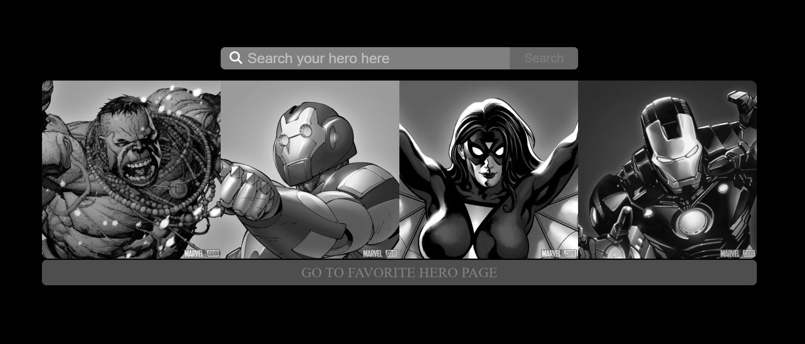
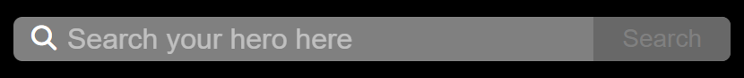

# Super Hero
The superhero app uses HTML, JavaScript, Bootstrap, and APIs from https://developer.marvel.com/docs. 
## <a name = "home">Home Page</a>
 
[The superhero app](https://ajithsinghsajitha.github.io/superhero/) shows a home page with search and cover images for heroes and upon searching search results are shown below the pictures.
Below the cover, a button for going to the favorite page, upon clicking the button a new page is opened and the page is shown. 
<mark> If the page is fetching data a loading animation is shown.</mark>
### Search Area
 
The search area has an input and a button to trigger the search. The search can be triggered by clicking the search button or pressing the enter key from the search box.
### Hero Cover
 
This area has four cover images, with each reload the images will be randomized and shown from a 12-image preset. While hovering over each image it's shown in colors.
### Go to favorite 
There is a button below the cover page, upon clicking this a new page is opened and favorite heroes are shown. <mark>Because of the slowness of the API call the redirection is shown in new pages to avoid waiting time in the home page.</mark>
### Search Result
 
The search results are below the favorite button where the user can set/unset the heroes as favorite. The result count is above the results. Clicking on the hero will open the hero on a new page. <mark>Because of the slowness of the API call the redirection is shown in new pages to avoid waiting time in the home page.</mark>

## Hero Page
On the hero page, the title is set as the hero's name. 

### Hero Details
 
The hero's name, a cover image and description of the hero are shown.
Followed by Comic, Series, Events and Story Tables are shown one after other if there is any. Each table only provides five columns. Under each table, there is a button to load more data into the table.  

## Favorite Page
 
Favorites are set from the [home page](#home) search result. Clicking on the 'GO TO FAVORITE HERO PAGE' Button, a new page will open with favorite heroes. Each hero has a remove button available, upon clicking the button the hero is removed from the list.
